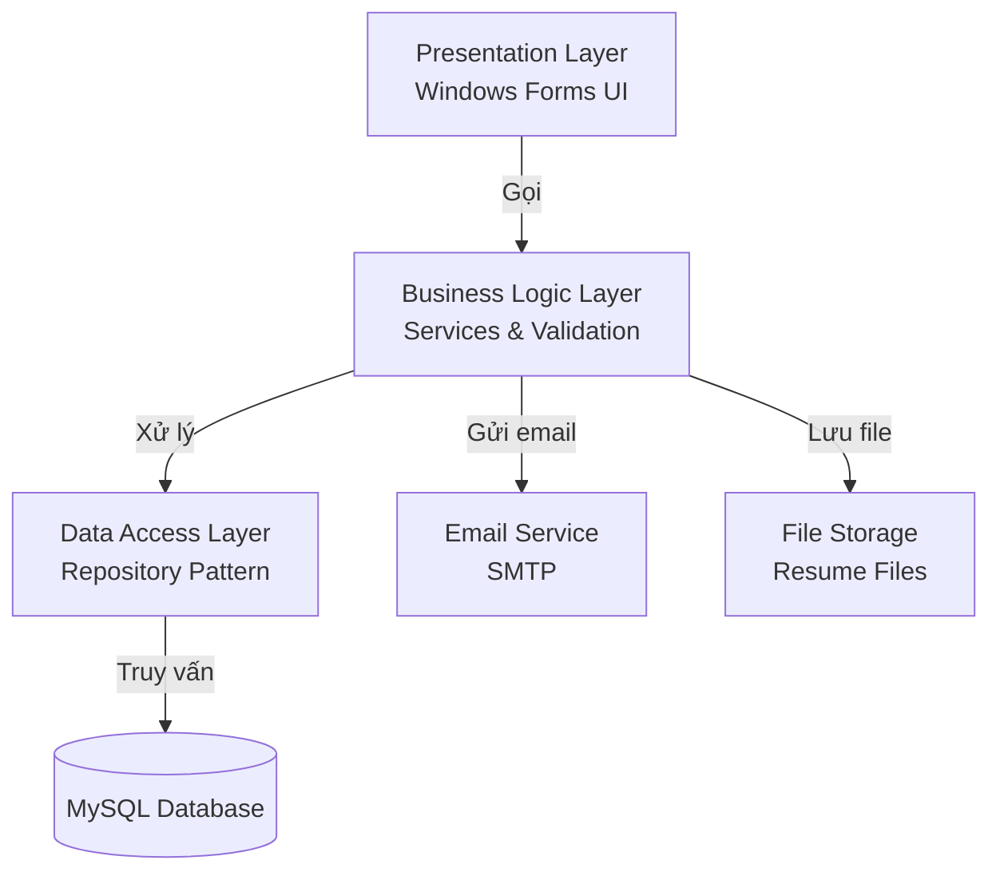
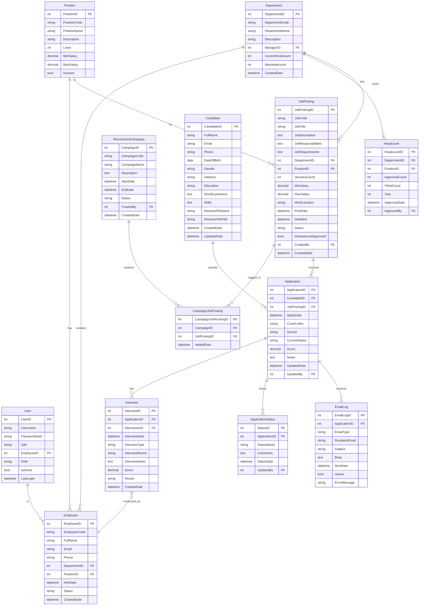
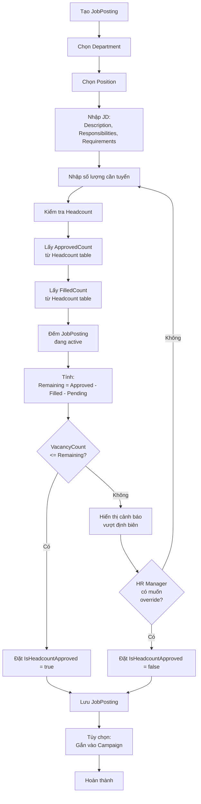
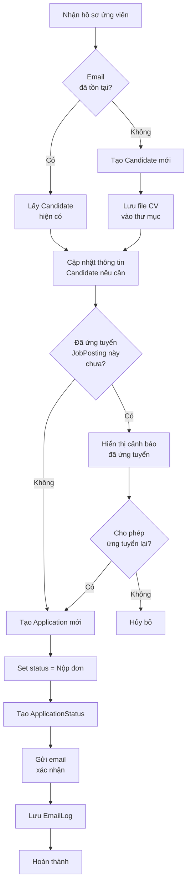
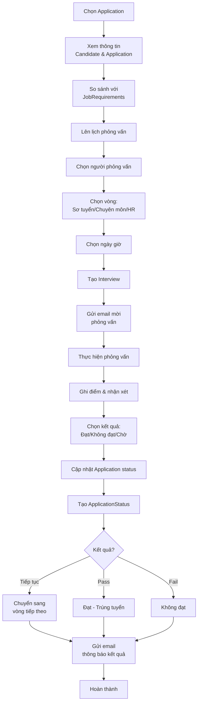
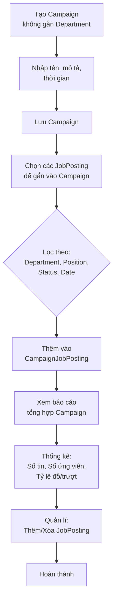

# Kế hoạch Hệ thống Quản lí Nhân sự (Phiên bản 2)

## Tổng quan Kiến trúc

Hệ thống sử dụng kiến trúc 3 lớp (3-Layer Architecture) với C# Windows Forms và MySQL:




## Cấu trúc Database (Đã sửa theo yêu cầu)

### Sơ đồ quan hệ các bảng




## Giải thích Thay đổi Database

### 1. Table Position (MỚI)

**Mục đích**: Quản lí danh mục các vị trí công việc trong công ty.**Lợi ích**:

- Chuẩn hóa tên vị trí
- Quản lí mức lương theo vị trí
- Dễ dàng thống kê theo vị trí
- Tham chiếu cho cả Employee và JobPosting

### 2. RecruitmentCampaign (ĐÃ SỬA)

**Thay đổi**: Bỏ `DepartmentID` - đợt tuyển dụng không thuộc phòng ban nào.**Chức năng**:

- Chỉ là "tag" hoặc "nhóm" để gom các tin tuyển dụng
- Ví dụ: "Đợt tuyển dụng Q1/2026", "Tuyển dụng mở rộng chi nhánh", "Tuyển dụng thay thế"
- Một tin tuyển dụng có thể thuộc nhiều đợt (quan hệ many-to-many)

### 3. CampaignJobPosting (MỚI)

**Mục đích**: Bảng trung gian liên kết many-to-many giữa Campaign và JobPosting.**Lợi ích**:

- Một JobPosting có thể thuộc nhiều Campaign
- Một Campaign chứa nhiều JobPosting
- Dễ dàng gắn/bỏ tag Campaign cho JobPosting

### 4. JobPosting (ĐÃ CẬP NHẬT)

**Thay đổi**:

- Thêm `DepartmentID` - tin tuyển dụng thuộc phòng ban cụ thể
- Thêm `PositionID` - tham chiếu đến Position
- Tách `JobDescription` thành 3 field:
- `JobDescription`: Mô tả công việc tổng quan
- `JobResponsibilities`: Trách nhiệm cụ thể (dùng để hiển thị)
- `JobRequirements`: Yêu cầu ứng viên (dùng để sàng lọc/JD)

### 5. Candidate (ĐÃ SỬA)

**Thay đổi**: Đây là **hồ sơ gốc** của ứng viên, không gắn trực tiếp với JobPosting.**Chức năng**:

- Lưu thông tin cá nhân đầy đủ
- Lưu thông tin hồ sơ gốc: `ResumeFileName`, `ResumeFilePath`
- File CV được lưu vào thư mục trên server/local
- Một người chỉ có 1 bản ghi Candidate duy nhất

### 6. Application (MỚI - QUAN TRỌNG)

**Mục đích**: Đại diện cho MỘT LẦN ứng tuyển của ứng viên vào một tin tuyển dụng.**Quan hệ**:

- Một Candidate có thể có nhiều Application (ứng tuyển nhiều lần)
- Một JobPosting có nhiều Application
- Application là trung tâm của quy trình tuyển dụng

**Chức năng**:

- Lưu thông tin cụ thể của lần ứng tuyển
- Theo dõi trạng thái riêng cho mỗi lần ứng tuyển
- Lưu thư xin việc (Cover Letter) riêng
- Nguồn ứng tuyển (Source): Website, Referral, LinkedIn, etc.
- Điểm số và ghi chú đánh giá

**Ví dụ thực tế**:

```javascript
Candidate: Nguyễn Văn A
  Application 1: Ứng tuyển vị trí "Java Developer" (JobPosting #101) - Trượt vòng 1
  Application 2: Ứng tuyển vị trí "C# Developer" (JobPosting #105) - Đang phỏng vấn vòng 2
  Application 3: Ứng tuyển lại "Java Developer" (JobPosting #120) - Đạt
```


### 7. ApplicationStatus (ĐÃ SỬA)

**Thay đổi**: Theo dõi trạng thái của Application (thay vì CandidateStatus).

### 8. Interview (ĐÃ CẬP NHẬT)

**Thay đổi**: Liên kết với Application (thay vì Candidate).

### 9. EmailLog (ĐÃ CẬP NHẬT)

**Thay đổi**: Liên kết với Application (thay vì Candidate).

## Luồng Nghiệp vụ Chi tiết

### 1. Quy trình Tạo tin tuyển dụng với Kiểm tra Định biên




### 2. Quy trình Ứng tuyển (1 người ứng tuyển nhiều lần)




### 3. Quy trình Phỏng vấn và Đánh giá




### 4. Quy trình Quản lí Đợt tuyển dụng (Campaign)




## Cấu trúc Thư mục Dự án

```javascript
LTHDT2/
├── Models/                    
│   ├── User.cs
│   ├── Position.cs                    # MỚI
│   ├── Department.cs
│   ├── Headcount.cs
│   ├── Employee.cs
│   ├── RecruitmentCampaign.cs
│   ├── CampaignJobPosting.cs          # MỚI
│   ├── JobPosting.cs
│   ├── Candidate.cs
│   ├── Application.cs                 # MỚI (quan trọng)
│   ├── ApplicationStatus.cs
│   ├── Interview.cs
│   └── EmailLog.cs
├── DataAccess/               
│   ├── DatabaseConnection.cs
│   ├── Repositories/
│   │   ├── IRepository.cs
│   │   ├── UserRepository.cs
│   │   ├── PositionRepository.cs
│   │   ├── DepartmentRepository.cs
│   │   ├── HeadcountRepository.cs
│   │   ├── EmployeeRepository.cs
│   │   ├── RecruitmentCampaignRepository.cs
│   │   ├── CampaignJobPostingRepository.cs
│   │   ├── JobPostingRepository.cs
│   │   ├── CandidateRepository.cs
│   │   ├── ApplicationRepository.cs
│   │   ├── ApplicationStatusRepository.cs
│   │   ├── InterviewRepository.cs
│   │   └── EmailLogRepository.cs
├── Services/                 
│   ├── AuthenticationService.cs
│   ├── PositionService.cs
│   ├── DepartmentService.cs
│   ├── HeadcountService.cs
│   ├── EmployeeService.cs
│   ├── CampaignService.cs
│   ├── RecruitmentService.cs          # Core service
│   ├── ApplicationService.cs          # MỚI
│   ├── EmailService.cs
│   ├── FileStorageService.cs          # MỚI
│   └── ValidationService.cs
├── Forms/                    
│   ├── MainForm.cs          
│   ├── Login/
│   │   ├── LoginForm.cs
│   │   └── ChangePasswordForm.cs
│   ├── Position/
│   │   ├── PositionListForm.cs        # MỚI
│   │   └── PositionEditForm.cs        # MỚI
│   ├── Department/
│   │   ├── DepartmentListForm.cs
│   │   ├── DepartmentEditForm.cs
│   │   └── HeadcountManagementForm.cs
│   ├── Employee/
│   │   ├── EmployeeListForm.cs
│   │   └── EmployeeEditForm.cs
│   └── Recruitment/
│       ├── RecruitmentCampaignListForm.cs
│       ├── RecruitmentCampaignEditForm.cs
│       ├── JobPostingListForm.cs
│       ├── JobPostingEditForm.cs
│       ├── CandidateListForm.cs           # Danh sách hồ sơ gốc
│       ├── CandidateEditForm.cs           # Sửa hồ sơ gốc
│       ├── ApplicationListForm.cs         # MỚI - Danh sách đơn ứng tuyển
│       ├── ApplicationDetailForm.cs       # MỚI - Chi tiết đơn ứng tuyển
│       ├── InterviewScheduleForm.cs
│       ├── InterviewEvaluationForm.cs
│       ├── EmailTemplateForm.cs
│       └── RecruitmentReportForm.cs
├── Utils/                    
│   ├── ConfigManager.cs
│   ├── PasswordHasher.cs
│   ├── EmailHelper.cs
│   ├── FileHelper.cs                  # MỚI
│   └── ReportGenerator.cs
└── Program.cs
```


## Chi tiết Tính năng

### Module Position (MỚI)

**PositionListForm.cs & PositionEditForm.cs**Chức năng:

- CRUD danh mục vị trí công việc
- Quản lí thông tin: Code, tên, mô tả, cấp bậc, mức lương min/max
- Active/Inactive vị trí
- Sử dụng cho cả Employee và JobPosting

### Module Đợt tuyển dụng (ĐÃ SỬA)

**RecruitmentCampaignListForm.cs & RecruitmentCampaignEditForm.cs**Chức năng:

- Tạo/Sửa/Xóa Campaign (không gắn Department)
- Gắn nhiều JobPosting vào Campaign (many-to-many)
- Xem danh sách JobPosting trong Campaign
- Thống kê tổng hợp theo Campaign
- Campaign như một "tag" để nhóm các tin tuyển dụng liên quan

### Module Tin tuyển dụng (ĐÃ CẬP NHẬT)

**JobPostingListForm.cs & JobPostingEditForm.cs**Chức năng:

- Tạo/Sửa/Xóa tin tuyển dụng
- Chọn Department và Position (bắt buộc)
- Nhập JD chi tiết:
- Job Description (mô tả tổng quan)
- Job Responsibilities (trách nhiệm - dùng để hiển thị)
- Job Requirements (yêu cầu - dùng để sàng lọc)
- Kiểm tra định biên tự động khi nhập số lượng
- Hiển thị cảnh báo nếu vượt định biên
- Cho phép override với quyền HR Manager
- Gắn/bỏ Campaign (many-to-many)

### Module Candidate (ĐÃ SỬA)

**CandidateListForm.cs & CandidateEditForm.cs**Chức năng:

- Quản lí hồ sơ gốc của ứng viên
- Thông tin đầy đủ: Họ tên, email, SĐT, ngày sinh, giới tính, địa chỉ
- Học vấn, kinh nghiệm làm việc, kỹ năng
- Upload và lưu file CV gốc (PDF, DOCX)
- Tìm kiếm ứng viên theo email, tên, kỹ năng
- Xem lịch sử ứng tuyển của ứng viên (danh sách Application)
- Một ứng viên chỉ có 1 bản ghi Candidate

### Module Application (MỚI - QUAN TRỌNG)

**ApplicationListForm.cs & ApplicationDetailForm.cs**Chức năng:

- Xem danh sách đơn ứng tuyển theo JobPosting
- Tạo đơn ứng tuyển mới:
- Chọn Candidate có sẵn hoặc tạo mới
- Kiểm tra trùng lặp (đã ứng tuyển JobPosting này chưa)
- Cho phép ứng tuyển lại nếu muốn
- Nhập thư xin việc (Cover Letter) riêng
- Ghi nguồn ứng tuyển
- Xem chi tiết đơn ứng tuyển:
- Thông tin Candidate
- Thông tin JobPosting
- Lịch sử trạng thái
- Lịch sử phỏng vấn
- Điểm số và ghi chú
- Cập nhật trạng thái đơn ứng tuyển
- Sàng lọc ứng viên theo JobRequirements
- Đánh giá và cho điểm

### Module Interview (ĐÃ CẬP NHẬT)

**InterviewScheduleForm.cs & InterviewEvaluationForm.cs**Chức năng:

- Lên lịch phỏng vấn cho Application (không phải Candidate)
- Phân công người phỏng vấn
- Chọn loại và vòng phỏng vấn (Vòng 1, Vòng 2, Vòng 3)
- Ghi nhận kết quả và điểm số
- Tự động gửi email mời phỏng vấn
- Tự động gửi email thông báo kết quả

### Module Email (ĐÃ CẬP NHẬT)

**EmailService.cs & EmailTemplateForm.cs**Các loại email gửi cho Application:

1. Email xác nhận nhận đơn ứng tuyển
2. Email mời phỏng vấn (có thông tin lịch)
3. Email thông báo kết quả từng vòng
4. Email chúc mừng trúng tuyển
5. Email từ chối

Chức năng:

- Tự động gửi email khi cập nhật trạng thái Application
- Gửi email thủ công
- Quản lí template email với placeholder
- Lưu log email vào EmailLog
- Retry khi gửi thất bại

### Module Báo cáo

**RecruitmentReportForm.cs**Báo cáo:

- Theo Campaign: Số tin, số ứng viên, tỷ lệ chuyển đổi
- Theo JobPosting: Số đơn ứng tuyển, tỷ lệ đỗ/trượt
- Theo Department: Định biên, đã tuyển, còn lại
- Theo thời gian: Thống kê theo tháng, quý, năm
- Hiệu suất tuyển dụng: Thời gian trung bình, nguồn ứng viên tốt nhất
- Xuất Excel/PDF

## Các Bước Triển khai theo Nguyên lý OOP

### GIAI ĐOẠN 1: SETUP DỰ ÁN VÀ DATABASE

**Mục tiêu**: Chuẩn bị môi trường phát triển

#### Bước 1.1: Setup Database MySQL

- Tạo database `HRManagementDB`
- Tạo tất cả các bảng theo sơ đồ ERD
- Thêm dữ liệu mẫu để test
- Cài đặt package `MySql.Data` qua NuGet

#### Bước 1.2: Cấu trúc thư mục dự án

- Tạo các folder: `Models`, `DataAccess`, `Services`, `Forms`, `Utils`
- Tạo file `App.config` để lưu connection string

---

### GIAI ĐOẠN 2: XÂY DỰNG MODELS - ÁP DỤNG ENCAPSULATION (ĐÓNG GÓI)

**Mục tiêu**: Học và áp dụng tính đóng gói**Khái niệm OOP - Encapsulation**:

- Đóng gói dữ liệu (fields) và hành vi (methods) vào trong class
- Sử dụng access modifiers: `private`, `protected`, `public`
- Sử dụng Properties để kiểm soát truy cập dữ liệu
- Validation trong setter

#### Bước 2.1: Tạo Base Entity Class

```csharp
// Models/BaseEntity.cs
public abstract class BaseEntity
{
    // Private field - chỉ truy cập trong class
    private int _id;
    private DateTime _createdDate;
    private DateTime? _updatedDate;
    
    // Public Property với validation trong setter
    public int Id 
    { 
        get => _id; 
        set 
        {
            if (value < 0) 
                throw new ArgumentException("Id không thể âm");
            _id = value;
        }
    }
    
    public DateTime CreatedDate 
    { 
        get => _createdDate; 
        protected set => _createdDate = value; // protected - chỉ class con truy cập
    }
    
    public DateTime? UpdatedDate 
    { 
        get => _updatedDate; 
        set => _updatedDate = value;
    }
    
    // Constructor
    protected BaseEntity()
    {
        _createdDate = DateTime.Now;
    }
}
```


#### Bước 2.2: Tạo các Model Classes kế thừa BaseEntity

**Ví dụ Employee.cs** - Thể hiện Encapsulation:

```csharp
// Models/Employee.cs
public class Employee : BaseEntity
{
    // Private fields
    private string _employeeCode;
    private string _fullName;
    private string _email;
    private string _phone;
    private int _departmentId;
    private int _positionId;
    
    // Properties với validation
    public string EmployeeCode 
    { 
        get => _employeeCode;
        set 
        {
            if (string.IsNullOrWhiteSpace(value))
                throw new ArgumentException("Mã nhân viên không được trống");
            _employeeCode = value.Trim().ToUpper();
        }
    }
    
    public string FullName
    {
        get => _fullName;
        set
        {
            if (string.IsNullOrWhiteSpace(value) || value.Length < 2)
                throw new ArgumentException("Họ tên phải có ít nhất 2 ký tự");
            _fullName = value.Trim();
        }
    }
    
    public string Email
    {
        get => _email;
        set
        {
            if (!IsValidEmail(value))
                throw new ArgumentException("Email không hợp lệ");
            _email = value.ToLower();
        }
    }
    
    public string Phone { get => _phone; set => _phone = value; }
    public int DepartmentId { get => _departmentId; set => _departmentId = value; }
    public int PositionId { get => _positionId; set => _positionId = value; }
    public DateTime HireDate { get; set; }
    public string Status { get; set; }
    
    // Navigation properties (cho ORM)
    public Department Department { get; set; }
    public Position Position { get; set; }
    
    // Private method - chỉ dùng trong class
    private bool IsValidEmail(string email)
    {
        if (string.IsNullOrWhiteSpace(email)) return false;
        return email.Contains("@") && email.Contains(".");
    }
    
    // Public method
    public string GetDisplayName()
    {
        return $"{EmployeeCode} - {FullName}";
    }
}
```


#### Bước 2.3: Tạo tất cả Models còn lại

- `Position.cs`, `Department.cs`, `Headcount.cs`
- `User.cs`, `RecruitmentCampaign.cs`, `CampaignJobPosting.cs`
- `JobPosting.cs`, `Candidate.cs`, `Application.cs`
- `ApplicationStatus.cs`, `Interview.cs`, `EmailLog.cs`

---

### GIAI ĐOẠN 3: TẠO BASE CLASSES VÀ INTERFACES - ÁP DỤNG ABSTRACTION (TRỪU TƯỢNG HÓA)

**Mục tiêu**: Học và áp dụng tính trừu tượng**Khái niệm OOP - Abstraction**:

- Abstract class: Class không thể khởi tạo trực tiếp, chứa các method abstract
- Interface: Định nghĩa "contract" mà class phải implement
- Ẩn đi chi tiết triển khai, chỉ expose những gì cần thiết

#### Bước 3.1: Tạo Interface IRepository (Generic Interface)

```csharp
// DataAccess/Repositories/IRepository.cs
public interface IRepository<T> where T : BaseEntity
{
    // CRUD operations
    T GetById(int id);
    IEnumerable<T> GetAll();
    int Add(T entity);
    bool Update(T entity);
    bool Delete(int id);
    
    // Search
    IEnumerable<T> Find(Func<T, bool> predicate);
}
```


#### Bước 3.2: Tạo Abstract Class BaseRepository

```csharp
// DataAccess/Repositories/BaseRepository.cs
public abstract class BaseRepository<T> : IRepository<T> where T : BaseEntity
{
    // Protected - class con có thể truy cập
    protected readonly string _connectionString;
    protected abstract string TableName { get; }
    
    protected BaseRepository()
    {
        _connectionString = ConfigurationManager.ConnectionStrings["HRManagementDB"].ConnectionString;
    }
    
    // Abstract methods - bắt buộc class con phải implement
    public abstract T GetById(int id);
    public abstract IEnumerable<T> GetAll();
    public abstract int Add(T entity);
    public abstract bool Update(T entity);
    
    // Virtual method - class con có thể override
    public virtual bool Delete(int id)
    {
        using (var conn = new MySqlConnection(_connectionString))
        {
            conn.Open();
            var cmd = new MySqlCommand($"DELETE FROM {TableName} WHERE Id = @Id", conn);
            cmd.Parameters.AddWithValue("@Id", id);
            return cmd.ExecuteNonQuery() > 0;
        }
    }
    
    // Concrete method - class con dùng trực tiếp
    public virtual IEnumerable<T> Find(Func<T, bool> predicate)
    {
        return GetAll().Where(predicate);
    }
    
    // Protected helper method
    protected MySqlConnection CreateConnection()
    {
        return new MySqlConnection(_connectionString);
    }
}
```


#### Bước 3.3: Tạo Interfaces cho Services

```csharp
// Services/IAuthenticationService.cs
public interface IAuthenticationService
{
    User Login(string username, string password);
    bool Logout();
    User GetCurrentUser();
    bool ChangePassword(int userId, string oldPassword, string newPassword);
}

// Services/IEmailService.cs
public interface IEmailService
{
    bool SendEmail(string to, string subject, string body);
    bool SendApplicationConfirmation(Application application);
    bool SendInterviewInvitation(Interview interview);
    bool SendResultNotification(Application application, string result);
}

// Services/IHeadcountService.cs
public interface IHeadcountService
{
    HeadcountResult CheckHeadcount(int departmentId, int positionId, int requestedCount);
    int GetRemainingHeadcount(int departmentId, int positionId);
    bool ApproveHeadcount(int departmentId, int positionId, int count);
}
```


#### Bước 3.4: Tạo Abstract Class BaseService

```csharp
// Services/BaseService.cs
public abstract class BaseService
{
    protected readonly User _currentUser;
    
    protected BaseService()
    {
        _currentUser = SessionManager.CurrentUser;
    }
    
    // Template method pattern
    protected void LogAction(string action, string details)
    {
        // Log ra console hoặc file
        Console.WriteLine($"[{DateTime.Now}] User: {_currentUser?.Username} - {action}: {details}");
    }
    
    protected void ValidatePermission(string requiredRole)
    {
        if (_currentUser == null)
            throw new UnauthorizedAccessException("Chưa đăng nhập");
        if (_currentUser.Role != requiredRole && _currentUser.Role != "Admin")
            throw new UnauthorizedAccessException("Không có quyền thực hiện");
    }
}
```

---

### GIAI ĐOẠN 4: XÂY DỰNG REPOSITORIES - ÁP DỤNG INHERITANCE (KẾ THỪA)

**Mục tiêu**: Học và áp dụng tính kế thừa**Khái niệm OOP - Inheritance**:

- Class con kế thừa properties và methods từ class cha
- Sử dụng từ khóa `: base()` để gọi constructor cha
- Override methods của class cha
- Tái sử dụng code, tránh lặp lại

#### Bước 4.1: Tạo EmployeeRepository kế thừa BaseRepository

```csharp
// DataAccess/Repositories/EmployeeRepository.cs
public class EmployeeRepository : BaseRepository<Employee>
{
    // Override abstract property
    protected override string TableName => "Employee";
    
    // Override abstract method - PHẢI implement
    public override Employee GetById(int id)
    {
        using (var conn = CreateConnection()) // Dùng method từ class cha
        {
            conn.Open();
            var cmd = new MySqlCommand(
                @"SELECT e.*, d.DepartmentName, p.PositionName 
                  FROM Employee e
                  LEFT JOIN Department d ON e.DepartmentID = d.DepartmentID
                  LEFT JOIN Position p ON e.PositionID = p.PositionID
                  WHERE e.EmployeeID = @Id", conn);
            cmd.Parameters.AddWithValue("@Id", id);
            
            using (var reader = cmd.ExecuteReader())
            {
                if (reader.Read())
                    return MapToEntity(reader);
            }
        }
        return null;
    }
    
    public override IEnumerable<Employee> GetAll()
    {
        var employees = new List<Employee>();
        using (var conn = CreateConnection())
        {
            conn.Open();
            var cmd = new MySqlCommand(
                @"SELECT e.*, d.DepartmentName, p.PositionName 
                  FROM Employee e
                  LEFT JOIN Department d ON e.DepartmentID = d.DepartmentID
                  LEFT JOIN Position p ON e.PositionID = p.PositionID", conn);
            
            using (var reader = cmd.ExecuteReader())
            {
                while (reader.Read())
                    employees.Add(MapToEntity(reader));
            }
        }
        return employees;
    }
    
    public override int Add(Employee entity)
    {
        using (var conn = CreateConnection())
        {
            conn.Open();
            var cmd = new MySqlCommand(
                @"INSERT INTO Employee (EmployeeCode, FullName, Email, Phone, DepartmentID, PositionID, HireDate, Status, CreatedDate)
                  VALUES (@Code, @Name, @Email, @Phone, @DeptId, @PosId, @HireDate, @Status, @Created);
                  SELECT LAST_INSERT_ID();", conn);
            
            cmd.Parameters.AddWithValue("@Code", entity.EmployeeCode);
            cmd.Parameters.AddWithValue("@Name", entity.FullName);
            cmd.Parameters.AddWithValue("@Email", entity.Email);
            cmd.Parameters.AddWithValue("@Phone", entity.Phone);
            cmd.Parameters.AddWithValue("@DeptId", entity.DepartmentId);
            cmd.Parameters.AddWithValue("@PosId", entity.PositionId);
            cmd.Parameters.AddWithValue("@HireDate", entity.HireDate);
            cmd.Parameters.AddWithValue("@Status", entity.Status);
            cmd.Parameters.AddWithValue("@Created", DateTime.Now);
            
            return Convert.ToInt32(cmd.ExecuteScalar());
        }
    }
    
    public override bool Update(Employee entity)
    {
        using (var conn = CreateConnection())
        {
            conn.Open();
            var cmd = new MySqlCommand(
                @"UPDATE Employee SET 
                    FullName = @Name, Email = @Email, Phone = @Phone,
                    DepartmentID = @DeptId, PositionID = @PosId, Status = @Status
                  WHERE EmployeeID = @Id", conn);
            
            cmd.Parameters.AddWithValue("@Id", entity.Id);
            cmd.Parameters.AddWithValue("@Name", entity.FullName);
            cmd.Parameters.AddWithValue("@Email", entity.Email);
            cmd.Parameters.AddWithValue("@Phone", entity.Phone);
            cmd.Parameters.AddWithValue("@DeptId", entity.DepartmentId);
            cmd.Parameters.AddWithValue("@PosId", entity.PositionId);
            cmd.Parameters.AddWithValue("@Status", entity.Status);
            
            return cmd.ExecuteNonQuery() > 0;
        }
    }
    
    // Method riêng của EmployeeRepository
    public IEnumerable<Employee> GetByDepartment(int departmentId)
    {
        return Find(e => e.DepartmentId == departmentId);
    }
    
    // Private helper method
    private Employee MapToEntity(MySqlDataReader reader)
    {
        return new Employee
        {
            Id = reader.GetInt32("EmployeeID"),
            EmployeeCode = reader.GetString("EmployeeCode"),
            FullName = reader.GetString("FullName"),
            Email = reader.GetString("Email"),
            Phone = reader.IsDBNull(reader.GetOrdinal("Phone")) ? null : reader.GetString("Phone"),
            DepartmentId = reader.GetInt32("DepartmentID"),
            PositionId = reader.GetInt32("PositionID"),
            HireDate = reader.GetDateTime("HireDate"),
            Status = reader.GetString("Status")
        };
    }
}
```


#### Bước 4.2: Tạo ApplicationRepository với các method đặc biệt

```csharp
// DataAccess/Repositories/ApplicationRepository.cs
public class ApplicationRepository : BaseRepository<Application>
{
    protected override string TableName => "Application";
    
    // Override methods...
    
    // Method riêng - kiểm tra ứng tuyển trùng
    public bool CheckDuplicateApplication(int candidateId, int jobPostingId)
    {
        using (var conn = CreateConnection())
        {
            conn.Open();
            var cmd = new MySqlCommand(
                "SELECT COUNT(*) FROM Application WHERE CandidateID = @CandId AND JobPostingID = @JobId", 
                conn);
            cmd.Parameters.AddWithValue("@CandId", candidateId);
            cmd.Parameters.AddWithValue("@JobId", jobPostingId);
            return Convert.ToInt32(cmd.ExecuteScalar()) > 0;
        }
    }
    
    // Lấy Application với đầy đủ thông tin
    public Application GetWithFullInfo(int applicationId)
    {
        // Join nhiều bảng...
    }
}
```


#### Bước 4.3: Tạo tất cả Repositories còn lại

- `UserRepository`, `PositionRepository`, `DepartmentRepository`
- `HeadcountRepository`, `JobPostingRepository`, `CandidateRepository`
- `InterviewRepository`, `EmailLogRepository`, `CampaignRepository`

---

### GIAI ĐOẠN 5: XÂY DỰNG SERVICES - ÁP DỤNG POLYMORPHISM (ĐA HÌNH)

**Mục tiêu**: Học và áp dụng tính đa hình**Khái niệm OOP - Polymorphism**:

- Một interface/abstract class có thể có nhiều implementations khác nhau
- Method overriding: Class con định nghĩa lại method của class cha
- Method overloading: Cùng tên method nhưng khác parameters
- Cho phép thay đổi behavior mà không sửa code gọi

#### Bước 5.1: Tạo AuthenticationService implement IAuthenticationService

```csharp
// Services/AuthenticationService.cs
public class AuthenticationService : BaseService, IAuthenticationService
{
    private readonly UserRepository _userRepository;
    
    public AuthenticationService()
    {
        _userRepository = new UserRepository();
    }
    
    public User Login(string username, string password)
    {
        var user = _userRepository.GetByUsername(username);
        if (user == null)
            return null;
            
        // Verify password using PasswordHasher
        if (!PasswordHasher.Verify(password, user.PasswordHash, user.Salt))
            return null;
        
        // Update last login
        user.LastLogin = DateTime.Now;
        _userRepository.Update(user);
        
        // Set session
        SessionManager.CurrentUser = user;
        LogAction("Login", $"User {username} logged in");
        
        return user;
    }
    
    public bool Logout()
    {
        LogAction("Logout", $"User {_currentUser?.Username} logged out");
        SessionManager.CurrentUser = null;
        return true;
    }
    
    public User GetCurrentUser() => SessionManager.CurrentUser;
    
    public bool ChangePassword(int userId, string oldPassword, string newPassword)
    {
        var user = _userRepository.GetById(userId);
        if (!PasswordHasher.Verify(oldPassword, user.PasswordHash, user.Salt))
            return false;
        
        var (hash, salt) = PasswordHasher.Hash(newPassword);
        user.PasswordHash = hash;
        user.Salt = salt;
        return _userRepository.Update(user);
    }
}
```


#### Bước 5.2: Tạo EmailService với Polymorphism (Method Overloading)

```csharp
// Services/EmailService.cs
public class EmailService : BaseService, IEmailService
{
    private readonly EmailLogRepository _emailLogRepository;
    private readonly SmtpClient _smtpClient;
    
    public EmailService()
    {
        _emailLogRepository = new EmailLogRepository();
        // Config SMTP từ App.config
    }
    
    // Method Overloading - cùng tên, khác parameters
    public bool SendEmail(string to, string subject, string body)
    {
        return SendEmail(to, subject, body, false); // Gọi overload khác
    }
    
    public bool SendEmail(string to, string subject, string body, bool isHtml)
    {
        try
        {
            var message = new MailMessage();
            message.To.Add(to);
            message.Subject = subject;
            message.Body = body;
            message.IsBodyHtml = isHtml;
            
            _smtpClient.Send(message);
            return true;
        }
        catch (Exception ex)
        {
            LogAction("EmailError", ex.Message);
            return false;
        }
    }
    
    // Polymorphism - khác implementation cho từng loại email
    public bool SendApplicationConfirmation(Application application)
    {
        var subject = "Xác nhận nhận hồ sơ ứng tuyển";
        var body = GetTemplate("ApplicationConfirmation")
            .Replace("{CandidateName}", application.Candidate.FullName)
            .Replace("{JobTitle}", application.JobPosting.JobTitle);
        
        var result = SendEmail(application.Candidate.Email, subject, body, true);
        LogEmail(application.Id, "Confirmation", result);
        return result;
    }
    
    public bool SendInterviewInvitation(Interview interview)
    {
        var subject = "Thư mời phỏng vấn";
        var body = GetTemplate("InterviewInvitation")
            .Replace("{CandidateName}", interview.Application.Candidate.FullName)
            .Replace("{InterviewDate}", interview.InterviewDate.ToString("dd/MM/yyyy HH:mm"))
            .Replace("{InterviewType}", interview.InterviewType);
        
        var result = SendEmail(interview.Application.Candidate.Email, subject, body, true);
        LogEmail(interview.Application.Id, "InterviewInvitation", result);
        return result;
    }
    
    public bool SendResultNotification(Application application, string result)
    {
        var templateName = result == "Pass" ? "PassNotification" : "FailNotification";
        var subject = result == "Pass" ? "Chúc mừng bạn đã trúng tuyển!" : "Thông báo kết quả ứng tuyển";
        var body = GetTemplate(templateName)
            .Replace("{CandidateName}", application.Candidate.FullName)
            .Replace("{JobTitle}", application.JobPosting.JobTitle);
        
        var sendResult = SendEmail(application.Candidate.Email, subject, body, true);
        LogEmail(application.Id, result == "Pass" ? "PassNotification" : "FailNotification", sendResult);
        return sendResult;
    }
    
    private string GetTemplate(string templateName) { /* Load từ file hoặc DB */ }
    private void LogEmail(int applicationId, string type, bool success) { /* Log vào EmailLog */ }
}
```


#### Bước 5.3: Tạo HeadcountService

```csharp
// Services/HeadcountService.cs
public class HeadcountService : BaseService, IHeadcountService
{
    private readonly HeadcountRepository _headcountRepository;
    private readonly JobPostingRepository _jobPostingRepository;
    
    public HeadcountResult CheckHeadcount(int departmentId, int positionId, int requestedCount)
    {
        var remaining = GetRemainingHeadcount(departmentId, positionId);
        return new HeadcountResult
        {
            IsApproved = requestedCount <= remaining,
            Remaining = remaining,
            Requested = requestedCount,
            Message = requestedCount <= remaining 
                ? "Đủ định biên" 
                : $"Vượt định biên {requestedCount - remaining} người"
        };
    }
    
    public int GetRemainingHeadcount(int departmentId, int positionId)
    {
        var headcount = _headcountRepository.GetByDepartmentAndPosition(departmentId, positionId, DateTime.Now.Year);
        if (headcount == null) return 0;
        
        var pendingJobPostings = _jobPostingRepository.CountPendingByDepartmentAndPosition(departmentId, positionId);
        return headcount.ApprovedCount - headcount.FilledCount - pendingJobPostings;
    }
    
    public bool ApproveHeadcount(int departmentId, int positionId, int count)
    {
        ValidatePermission("HRManager"); // Từ BaseService
        // Implementation...
    }
}
```


#### Bước 5.4: Tạo ApplicationService (Core Service)

```csharp
// Services/ApplicationService.cs
public class ApplicationService : BaseService
{
    private readonly ApplicationRepository _applicationRepository;
    private readonly CandidateRepository _candidateRepository;
    private readonly IEmailService _emailService; // Dependency Injection qua Interface
    
    // Constructor Injection - nhận dependency qua constructor
    public ApplicationService(IEmailService emailService)
    {
        _applicationRepository = new ApplicationRepository();
        _candidateRepository = new CandidateRepository();
        _emailService = emailService;
    }
    
    public ApplicationResult CreateApplication(int candidateId, int jobPostingId, string coverLetter, string source)
    {
        // Kiểm tra trùng lặp
        if (_applicationRepository.CheckDuplicateApplication(candidateId, jobPostingId))
        {
            return new ApplicationResult 
            { 
                Success = false, 
                Message = "Ứng viên đã ứng tuyển vị trí này" 
            };
        }
        
        var application = new Application
        {
            CandidateId = candidateId,
            JobPostingId = jobPostingId,
            CoverLetter = coverLetter,
            Source = source,
            ApplyDate = DateTime.Now,
            CurrentStatus = "Nộp đơn"
        };
        
        var id = _applicationRepository.Add(application);
        application.Id = id;
        
        // Load full info để gửi email
        application = _applicationRepository.GetWithFullInfo(id);
        
        // Gửi email xác nhận
        _emailService.SendApplicationConfirmation(application);
        
        LogAction("CreateApplication", $"Created application #{id}");
        
        return new ApplicationResult { Success = true, Application = application };
    }
    
    public bool UpdateStatus(int applicationId, string newStatus, string comments)
    {
        var application = _applicationRepository.GetWithFullInfo(applicationId);
        application.CurrentStatus = newStatus;
        application.UpdatedDate = DateTime.Now;
        
        _applicationRepository.Update(application);
        
        // Gửi email thông báo kết quả nếu là trạng thái cuối
        if (newStatus == "Đạt" || newStatus == "Không đạt")
        {
            _emailService.SendResultNotification(application, newStatus == "Đạt" ? "Pass" : "Fail");
        }
        
        return true;
    }
}
```


#### Bước 5.5: Tạo các Services còn lại

- `PositionService`, `DepartmentService`, `EmployeeService`
- `RecruitmentService`, `CampaignService`, `FileStorageService`

---

### GIAI ĐOẠN 6: TẠO BASEFORM - ÁP DỤNG INHERITANCE CHO UI

**Mục tiêu**: Tái sử dụng code trong UI layer

#### Bước 6.1: Tạo BaseForm

```csharp
// Forms/BaseForm.cs
public class BaseForm : Form
{
    protected User CurrentUser => SessionManager.CurrentUser;
    
    public BaseForm()
    {
        this.Load += BaseForm_Load;
        this.FormClosing += BaseForm_FormClosing;
    }
    
    // Virtual method - cho phép override
    protected virtual void BaseForm_Load(object sender, EventArgs e)
    {
        // Kiểm tra đăng nhập
        if (CurrentUser == null && !(this is LoginForm))
        {
            MessageBox.Show("Vui lòng đăng nhập!");
            this.Close();
        }
    }
    
    protected virtual void BaseForm_FormClosing(object sender, FormClosingEventArgs e)
    {
        // Override nếu cần xử lý khi đóng form
    }
    
    // Helper methods cho tất cả forms
    protected void ShowError(string message)
    {
        MessageBox.Show(message, "Lỗi", MessageBoxButtons.OK, MessageBoxIcon.Error);
    }
    
    protected void ShowSuccess(string message)
    {
        MessageBox.Show(message, "Thành công", MessageBoxButtons.OK, MessageBoxIcon.Information);
    }
    
    protected bool Confirm(string message)
    {
        return MessageBox.Show(message, "Xác nhận", MessageBoxButtons.YesNo, MessageBoxIcon.Question) == DialogResult.Yes;
    }
    
    // Kiểm tra quyền
    protected bool HasPermission(string role)
    {
        return CurrentUser?.Role == role || CurrentUser?.Role == "Admin";
    }
}
```


#### Bước 6.2: Tạo BaseListForm (cho các form danh sách)

```csharp
// Forms/BaseListForm.cs
public class BaseListForm<T> : BaseForm where T : BaseEntity
{
    protected DataGridView dataGridView;
    protected TextBox txtSearch;
    protected Button btnAdd, btnEdit, btnDelete, btnRefresh;
    
    // Abstract method - class con phải implement
    protected abstract void LoadData();
    protected abstract void OnAdd();
    protected abstract void OnEdit(T entity);
    protected abstract void OnDelete(T entity);
    
    // Virtual method - có thể override
    protected virtual void OnSearch(string keyword)
    {
        LoadData(); // Default: reload all
    }
    
    protected override void BaseForm_Load(object sender, EventArgs e)
    {
        base.BaseForm_Load(sender, e);
        SetupControls();
        LoadData();
    }
    
    private void SetupControls()
    {
        btnAdd.Click += (s, e) => OnAdd();
        btnEdit.Click += (s, e) => {
            if (dataGridView.CurrentRow?.DataBoundItem is T entity)
                OnEdit(entity);
        };
        btnDelete.Click += (s, e) => {
            if (dataGridView.CurrentRow?.DataBoundItem is T entity)
                if (Confirm("Bạn có chắc muốn xóa?"))
                    OnDelete(entity);
        };
        btnRefresh.Click += (s, e) => LoadData();
        txtSearch.TextChanged += (s, e) => OnSearch(txtSearch.Text);
    }
}
```


#### Bước 6.3: Tạo BaseEditForm (cho các form thêm/sửa)

```csharp
// Forms/BaseEditForm.cs
public class BaseEditForm<T> : BaseForm where T : BaseEntity, new()
{
    protected T Entity { get; set; }
    protected bool IsEditMode => Entity?.Id > 0;
    
    protected Button btnSave, btnCancel;
    
    // Abstract methods
    protected abstract void LoadEntity();
    protected abstract void SaveEntity();
    protected abstract bool ValidateInput();
    
    public BaseEditForm(T entity = null)
    {
        Entity = entity ?? new T();
    }
    
    protected override void BaseForm_Load(object sender, EventArgs e)
    {
        base.BaseForm_Load(sender, e);
        SetupControls();
        if (IsEditMode)
            LoadEntity();
    }
    
    private void SetupControls()
    {
        btnSave.Click += (s, e) => {
            if (ValidateInput())
            {
                SaveEntity();
                ShowSuccess(IsEditMode ? "Cập nhật thành công!" : "Thêm mới thành công!");
                this.DialogResult = DialogResult.OK;
                this.Close();
            }
        };
        btnCancel.Click += (s, e) => {
            this.DialogResult = DialogResult.Cancel;
            this.Close();
        };
    }
}
```

---

### GIAI ĐOẠN 7: XÂY DỰNG CÁC FORMS KẾ THỪA BASEFORM

**Mục tiêu**: Áp dụng Inheritance trong UI

#### Bước 7.1: Tạo LoginForm

```csharp
// Forms/Login/LoginForm.cs
public partial class LoginForm : BaseForm
{
    private readonly IAuthenticationService _authService;
    
    public LoginForm()
    {
        InitializeComponent();
        _authService = new AuthenticationService();
    }
    
    private void btnLogin_Click(object sender, EventArgs e)
    {
        var user = _authService.Login(txtUsername.Text, txtPassword.Text);
        if (user != null)
        {
            ShowSuccess($"Xin chào {user.Username}!");
            this.DialogResult = DialogResult.OK;
            this.Close();
        }
        else
        {
            ShowError("Sai tên đăng nhập hoặc mật khẩu!");
        }
    }
}
```


#### Bước 7.2: Tạo EmployeeListForm kế thừa BaseListForm

```csharp
// Forms/Employee/EmployeeListForm.cs
public partial class EmployeeListForm : BaseListForm<Employee>
{
    private readonly EmployeeRepository _repository;
    
    public EmployeeListForm()
    {
        InitializeComponent();
        _repository = new EmployeeRepository();
    }
    
    // Override abstract methods
    protected override void LoadData()
    {
        dataGridView.DataSource = _repository.GetAll().ToList();
    }
    
    protected override void OnAdd()
    {
        var form = new EmployeeEditForm();
        if (form.ShowDialog() == DialogResult.OK)
            LoadData();
    }
    
    protected override void OnEdit(Employee entity)
    {
        var form = new EmployeeEditForm(entity);
        if (form.ShowDialog() == DialogResult.OK)
            LoadData();
    }
    
    protected override void OnDelete(Employee entity)
    {
        if (_repository.Delete(entity.Id))
        {
            ShowSuccess("Xóa thành công!");
            LoadData();
        }
    }
    
    // Override search method
    protected override void OnSearch(string keyword)
    {
        if (string.IsNullOrWhiteSpace(keyword))
            LoadData();
        else
            dataGridView.DataSource = _repository.Find(e => 
                e.FullName.Contains(keyword) || 
                e.Email.Contains(keyword) ||
                e.EmployeeCode.Contains(keyword)
            ).ToList();
    }
}
```


#### Bước 7.3: Tạo EmployeeEditForm kế thừa BaseEditForm

```csharp
// Forms/Employee/EmployeeEditForm.cs
public partial class EmployeeEditForm : BaseEditForm<Employee>
{
    private readonly EmployeeRepository _repository;
    
    public EmployeeEditForm(Employee entity = null) : base(entity)
    {
        InitializeComponent();
        _repository = new EmployeeRepository();
    }
    
    protected override void LoadEntity()
    {
        txtCode.Text = Entity.EmployeeCode;
        txtName.Text = Entity.FullName;
        txtEmail.Text = Entity.Email;
        txtPhone.Text = Entity.Phone;
        cmbDepartment.SelectedValue = Entity.DepartmentId;
        cmbPosition.SelectedValue = Entity.PositionId;
        dtpHireDate.Value = Entity.HireDate;
    }
    
    protected override bool ValidateInput()
    {
        if (string.IsNullOrWhiteSpace(txtCode.Text))
        {
            ShowError("Vui lòng nhập mã nhân viên!");
            return false;
        }
        if (string.IsNullOrWhiteSpace(txtName.Text))
        {
            ShowError("Vui lòng nhập họ tên!");
            return false;
        }
        // More validations...
        return true;
    }
    
    protected override void SaveEntity()
    {
        Entity.EmployeeCode = txtCode.Text;
        Entity.FullName = txtName.Text;
        Entity.Email = txtEmail.Text;
        Entity.Phone = txtPhone.Text;
        Entity.DepartmentId = (int)cmbDepartment.SelectedValue;
        Entity.PositionId = (int)cmbPosition.SelectedValue;
        Entity.HireDate = dtpHireDate.Value;
        Entity.Status = "Active";
        
        if (IsEditMode)
            _repository.Update(Entity);
        else
            _repository.Add(Entity);
    }
}
```


#### Bước 7.4: Tạo tất cả Forms còn lại

- **Position**: `PositionListForm`, `PositionEditForm`
- **Department**: `DepartmentListForm`, `DepartmentEditForm`, `HeadcountManagementForm`
- **Recruitment**: `JobPostingListForm`, `JobPostingEditForm`
- **Candidate**: `CandidateListForm`, `CandidateEditForm`
- **Application**: `ApplicationListForm`, `ApplicationDetailForm`
- **Interview**: `InterviewScheduleForm`, `InterviewEvaluationForm`
- **Campaign**: `CampaignListForm`, `CampaignEditForm`
- **Report**: `RecruitmentReportForm`

---

### GIAI ĐOẠN 8: TÍCH HỢP HỆ THỐNG VÀ HOÀN THIỆN

#### Bước 8.1: Tạo MainForm với Menu điều hướng

```csharp
// Forms/MainForm.cs
public partial class MainForm : BaseForm
{
    public MainForm()
    {
        InitializeComponent();
        SetupMenu();
    }
    
    private void SetupMenu()
    {
        // Ẩn/hiện menu theo quyền
        menuHeadcount.Visible = HasPermission("HRManager");
        menuReport.Visible = HasPermission("HRManager");
    }
    
    private void menuEmployee_Click(object sender, EventArgs e)
    {
        OpenChildForm(new EmployeeListForm());
    }
    
    private void OpenChildForm(Form form)
    {
        form.MdiParent = this;
        form.Show();
    }
}
```


#### Bước 8.2: Cập nhật Program.cs

```csharp
// Program.cs
static class Program
{
    [STAThread]
    static void Main()
    {
        ApplicationConfiguration.Initialize();
        
        // Hiển thị LoginForm trước
        var loginForm = new LoginForm();
        if (loginForm.ShowDialog() == DialogResult.OK)
        {
            // Nếu đăng nhập thành công, mở MainForm
            Application.Run(new MainForm());
        }
    }
}
```


#### Bước 8.3: Tích hợp Email tự động

- Cấu hình SMTP trong App.config
- Test gửi email khi tạo Application
- Test gửi email khi cập nhật trạng thái

#### Bước 8.4: Testing và Debug

- Test từng module
- Test case: 1 người ứng tuyển nhiều lần
- Test kiểm tra định biên
- Test đăng nhập và phân quyền

#### Bước 8.5: Hoàn thiện UI và UX

- Thêm icons, tooltips
- Xử lý exception
- Thêm loading indicator
- Optimize performance

---

## Tóm tắt Áp dụng 4 Tính chất OOP

| Tính chất | Áp dụng trong dự án ||-----------|---------------------|| **Encapsulation** | Private fields + Public properties với validation trong Models || **Abstraction** | Interface (IRepository, IEmailService) và Abstract class (BaseRepository, BaseService) || **Inheritance** | Models kế thừa BaseEntity, Repositories kế thừa BaseRepository, Forms kế thừa BaseForm || **Polymorphism** | Method overriding trong Repositories, Method overloading trong EmailService, Interface implementations |

## Công nghệ và Package NuGet

- **Framework**: .NET 10.0 Windows Forms
- **Database**: MySQL 8.0+
- **Packages**:
- MySql.Data hoặc MySqlConnector (database)
- MailKit (SMTP email)
- ClosedXML (export Excel)
- System.Configuration.ConfigurationManager (config)
- System.Security.Cryptography (password hash)

## Script SQL Quan trọng

### Kiểm tra định biên

```sql
SELECT 
    h.ApprovedCount,
    h.FilledCount,
    (SELECT COUNT(*) FROM JobPosting 
     WHERE DepartmentID = h.DepartmentID 
     AND PositionID = h.PositionID 
     AND Status = 'Active') as PendingCount,
    (h.ApprovedCount - h.FilledCount - (SELECT COUNT(*) FROM JobPosting 
     WHERE DepartmentID = h.DepartmentID 
     AND PositionID = h.PositionID 
     AND Status = 'Active')) as Remaining
FROM Headcount h
WHERE h.DepartmentID = ? AND h.PositionID = ? AND h.Year = YEAR(NOW())
```


### Kiểm tra trùng lặp ứng tuyển

```sql
SELECT COUNT(*) 
FROM Application 
WHERE CandidateID = ? AND JobPostingID = ?
```


### Lấy Application với đầy đủ thông tin

```sql
SELECT a.*, c.*, j.JobTitle, j.DepartmentID, d.DepartmentName, p.PositionName
FROM Application a
JOIN Candidate c ON a.CandidateID = c.CandidateID
JOIN JobPosting j ON a.JobPostingID = j.JobPostingID
JOIN Department d ON j.DepartmentID = d.DepartmentID
JOIN Position p ON j.PositionID = p.PositionID
WHERE a.ApplicationID = ?
```


## Files Quan trọng (Theo nguyên lý OOP)

### Base Classes (Abstraction & Inheritance)

- `Models/BaseEntity.cs`: Abstract class cha cho tất cả Models
- `DataAccess/Repositories/IRepository.cs`: Generic Interface định nghĩa contract
- `DataAccess/Repositories/BaseRepository.cs`: Abstract class cha cho Repositories
- `Services/BaseService.cs`: Abstract class cha cho Services
- `Forms/BaseForm.cs`: Class cha cho tất cả Forms
- `Forms/BaseListForm.cs`: Generic class cha cho forms danh sách
- `Forms/BaseEditForm.cs`: Generic class cha cho forms thêm/sửa

### Interfaces (Abstraction)

- `Services/IAuthenticationService.cs`: Contract cho authentication
- `Services/IEmailService.cs`: Contract cho gửi email
- `Services/IHeadcountService.cs`: Contract cho kiểm tra định biên

### Core Implementations

- [`Program.cs`](Program.cs): Entry point
- `Models/Application.cs`: Model quan trọng nhất (Encapsulation)
- `Services/ApplicationService.cs`: Logic xử lí đơn ứng tuyển (Polymorphism)
- `Services/EmailService.cs`: Gửi email với method overloading

---

## Tóm tắt Kiến thức OOP Áp dụng

### 1. Encapsulation (Đóng gói)

```csharp
// Private fields + Public properties với validation
private string _email;
public string Email 
{
    get => _email;
    set 
    {
        if (!IsValidEmail(value)) throw new ArgumentException("Email không hợp lệ");
        _email = value;
    }
}
```


### 2. Abstraction (Trừu tượng)

```csharp
// Interface - định nghĩa contract
public interface IRepository<T> { T GetById(int id); }

// Abstract class - chứa logic chung
public abstract class BaseRepository<T> : IRepository<T>
{
    public abstract T GetById(int id); // Bắt buộc implement
    public virtual bool Delete(int id) { /* Logic chung */ } // Có thể override
}
```


### 3. Inheritance (Kế thừa)

```csharp
// Model kế thừa BaseEntity
public class Employee : BaseEntity { }

// Repository kế thừa BaseRepository
public class EmployeeRepository : BaseRepository<Employee>
{
    public override Employee GetById(int id) { /* Implementation */ }
}

// Form kế thừa BaseListForm
public class EmployeeListForm : BaseListForm<Employee> { }
```


### 4. Polymorphism (Đa hình)

```csharp
// Method Overriding
public override Employee GetById(int id) { /* Implementation riêng */ }

// Method Overloading
public bool SendEmail(string to, string subject, string body) { }
public bool SendEmail(string to, string subject, string body, bool isHtml) { }

// Interface Polymorphism
IEmailService emailService = new EmailService();
emailService.SendEmail(...); // Gọi qua interface
```

---

## Lưu ý Quan trọng cho Môn học

1. **Đảm bảo áp dụng đủ 4 tính chất OOP** trong code