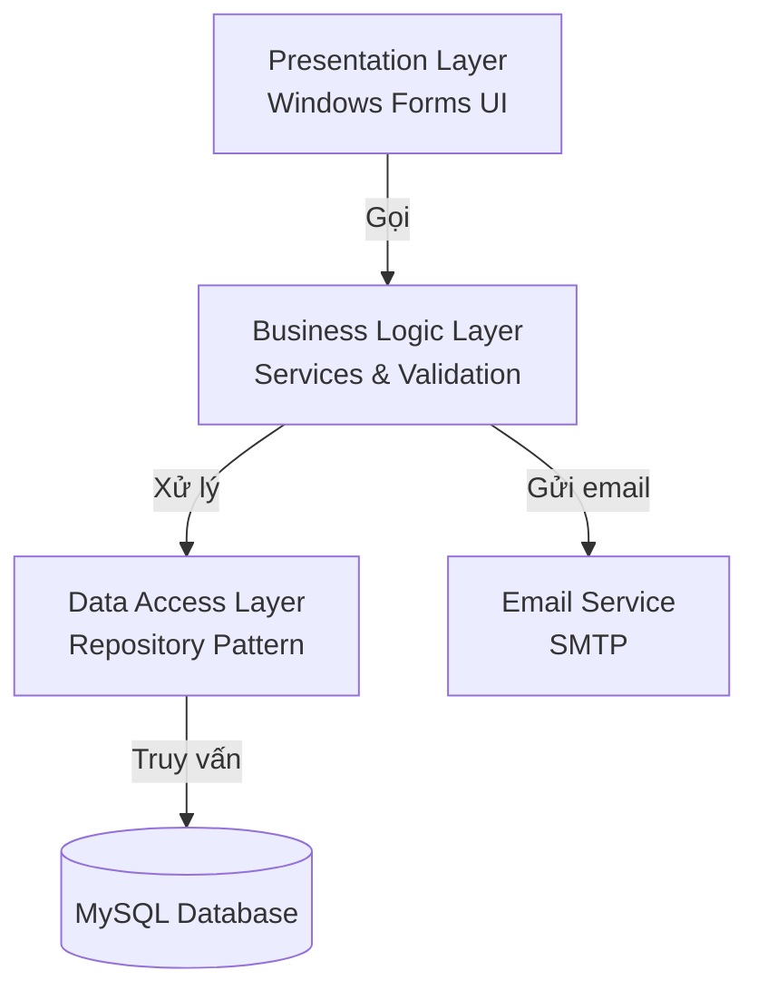
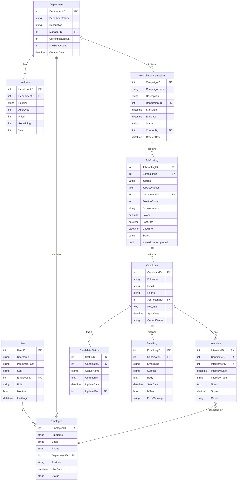
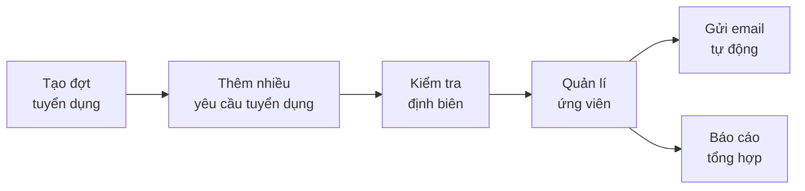
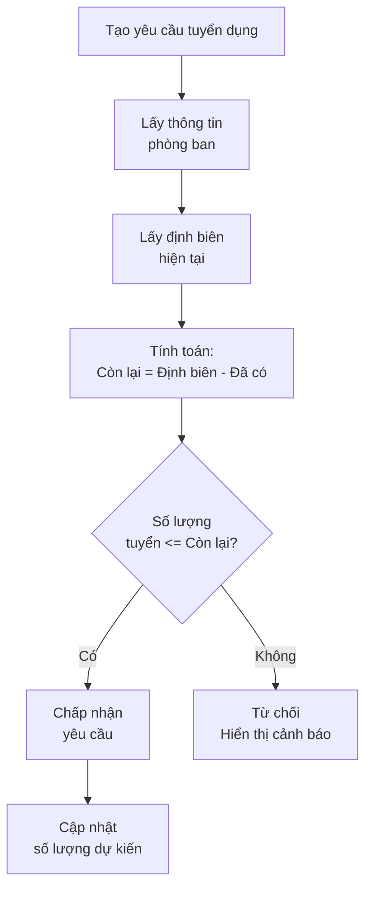
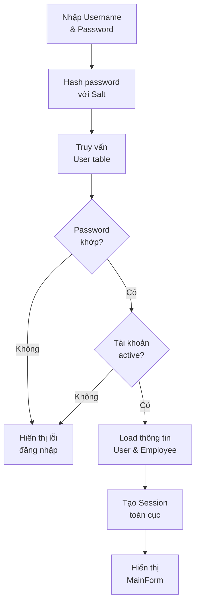
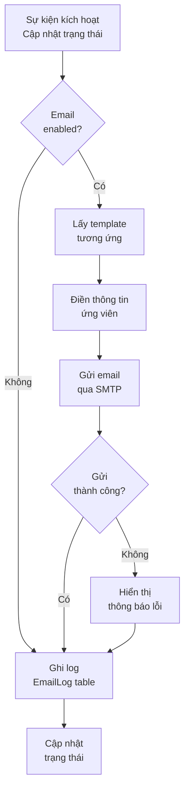

# Kế hoạch Hệ thống Quản lí Nhân sự (Cập nhật)

## Tổng quan Kiến trúc

Hệ thống sử dụng kiến trúc 3 lớp (3-Layer Architecture) với C# Windows Forms và MySQL:




## Cấu trúc Database (Cập nhật)

### Các bảng chính




## Cấu trúc Thư mục Dự án (Cập nhật)

```javascript
LTHDT2/
├── Models/                    
│   ├── User.cs                    # MỚI
│   ├── Department.cs
│   ├── Headcount.cs               # MỚI
│   ├── RecruitmentCampaign.cs     # MỚI
│   ├── Employee.cs
│   ├── JobPosting.cs
│   ├── Candidate.cs
│   ├── Interview.cs
│   ├── CandidateStatus.cs
│   └── EmailLog.cs                # MỚI
├── DataAccess/               
│   ├── DatabaseConnection.cs
│   ├── Repositories/
│   │   ├── IRepository.cs
│   │   ├── UserRepository.cs             # MỚI
│   │   ├── DepartmentRepository.cs
│   │   ├── HeadcountRepository.cs        # MỚI
│   │   ├── RecruitmentCampaignRepository.cs  # MỚI
│   │   ├── EmployeeRepository.cs
│   │   ├── JobPostingRepository.cs
│   │   ├── CandidateRepository.cs
│   │   ├── InterviewRepository.cs
│   │   └── EmailLogRepository.cs         # MỚI
├── Services/                 
│   ├── AuthenticationService.cs   # MỚI
│   ├── DepartmentService.cs
│   ├── HeadcountService.cs        # MỚI
│   ├── EmployeeService.cs
│   ├── RecruitmentService.cs
│   ├── EmailService.cs            # MỚI
│   └── ValidationService.cs
├── Forms/                    
│   ├── MainForm.cs          
│   ├── Login/
│   │   ├── LoginForm.cs           # CẬP NHẬT
│   │   └── ChangePasswordForm.cs  # MỚI
│   ├── Department/
│   │   ├── DepartmentListForm.cs
│   │   ├── DepartmentEditForm.cs
│   │   └── HeadcountManagementForm.cs  # MỚI
│   ├── Employee/
│   │   ├── EmployeeListForm.cs
│   │   └── EmployeeEditForm.cs
│   └── Recruitment/
│       ├── RecruitmentCampaignListForm.cs    # MỚI
│       ├── RecruitmentCampaignEditForm.cs    # MỚI
│       ├── JobPostingListForm.cs
│       ├── JobPostingEditForm.cs             # CẬP NHẬT (kiểm tra định biên)
│       ├── CandidateListForm.cs
│       ├── CandidateDetailForm.cs
│       ├── InterviewScheduleForm.cs
│       ├── InterviewEvaluationForm.cs
│       ├── EmailTemplateForm.cs              # MỚI
│       └── RecruitmentReportForm.cs
├── Utils/                    
│   ├── ConfigManager.cs
│   ├── PasswordHasher.cs          # MỚI
│   ├── EmailHelper.cs             # CẬP NHẬT
│   └── ReportGenerator.cs
└── Program.cs
```


## Tính năng Mới Bổ sung

### 1. Quản lí Đợt Tuyển dụng (RecruitmentCampaign)

**Mục đích**: Nhóm nhiều yêu cầu tuyển dụng (JobPosting) vào một đợt tuyển dụng để quản lí tập trung.**Quy trình**:



**Chức năng**:

- Tạo đợt tuyển dụng với tên, mô tả, thời gian bắt đầu/kết thúc
- Gắn đợt tuyển dụng với phòng ban
- Thêm nhiều yêu cầu tuyển dụng vào một đợt
- Xem tổng quan tất cả yêu cầu trong đợt
- Theo dõi tiến độ của cả đợt tuyển dụng
- Trạng thái: Đang chuẩn bị, Đang tuyển, Hoàn thành, Hủy

**Form**: `RecruitmentCampaignListForm.cs`, `RecruitmentCampaignEditForm.cs`

### 2. Kiểm tra Định biên (Headcount Validation)

**Mục đích**: Đảm bảo số lượng tuyển dụng không vượt quá định biên được phê duyệt của phòng ban.**Quy trình kiểm tra**:



**Công thức**:

```javascript
Remaining = MaxHeadcount - CurrentHeadcount - PendingRecruitments
If (RequestedPositionCount <= Remaining) Then Approve
Else Reject with Warning
```

**Chức năng**:

- Quản lí định biên của từng phòng ban theo năm
- Quản lí định biên theo vị trí (Position)
- Theo dõi: Đã phê duyệt, Đã tuyển, Còn lại
- Cảnh báo khi tạo yêu cầu tuyển dụng vượt định biên
- Cho phép request vượt định biên (cần phê duyệt đặc biệt)
- Lịch sử thay đổi định biên

**Form**: `HeadcountManagementForm.cs`, tích hợp vào `JobPostingEditForm.cs`

### 3. Hệ thống Đăng nhập (Authentication)

**Mục đích**: Bảo mật hệ thống và phân quyền người dùng.**Quy trình đăng nhập**:



**Chức năng**:

- Đăng nhập bằng Username/Password
- Mã hóa mật khẩu bằng SHA256 + Salt
- Phân quyền: Admin, HR Manager, HR Staff, Department Manager
- Lưu thông tin người dùng hiện tại (CurrentUser session)
- Đổi mật khẩu
- Logout
- Ghi log lần đăng nhập cuối

**Phân quyền**:

- **Admin**: Toàn quyền
- **HR Manager**: Quản lí toàn bộ module tuyển dụng
- **HR Staff**: Thực hiện tuyển dụng, không sửa định biên
- **Department Manager**: Xem yêu cầu tuyển dụng của phòng mình

**Form**: `LoginForm.cs`, `ChangePasswordForm.cs`

### 4. Gửi Email Tự động (Email Automation)

**Mục đích**: Tự động thông báo kết quả cho ứng viên qua email.**Các loại email**:

1. **Email xác nhận nhận hồ sơ**

- Gửi sau khi ứng viên nộp đơn
- Nội dung: Cảm ơn, thông tin đợt tuyển dụng

2. **Email mời phỏng vấn**

- Gửi khi lên lịch phỏng vấn
- Nội dung: Thời gian, địa điểm, người phỏng vấn

3. **Email thông báo kết quả**

- Gửi sau mỗi vòng phỏng vấn
- Nội dung: Đỗ/Trượt, lý do, bước tiếp theo

4. **Email chúc mừng trúng tuyển**

- Gửi khi ứng viên đạt
- Nội dung: Chúc mừng, hướng dẫn onboarding

5. **Email từ chối**

- Gửi khi ứng viên không đạt
- Nội dung: Cảm ơn, khuyến khích apply lần sau

**Quy trình gửi email**:



**Cấu hình SMTP**:

- Sử dụng Gmail SMTP hoặc SMTP server riêng
- Lưu cấu hình trong app.config
- Host, Port, Username, Password, EnableSSL

**Chức năng**:

- Quản lí template email (HTML format)
- Tự động gửi email khi thay đổi trạng thái ứng viên
- Gửi email thủ công
- Xem lịch sử email đã gửi
- Retry khi gửi thất bại
- Preview email trước khi gửi

**Service**: `EmailService.cs`, **Form**: `EmailTemplateForm.cs`

## Các Bước Triển khai (Cập nhật)

### Bước 1: Setup Database và Connection

- Tạo database MySQL và các bảng (bao gồm bảng mới)
- Viết class `DatabaseConnection.cs`
- Thêm package MySql.Data hoặc MySqlConnector

### Bước 2: Tạo Models

- Tạo tất cả các class entity
- Đặc biệt: User, RecruitmentCampaign, Headcount, EmailLog

### Bước 3: Xây dựng Data Access Layer

- Implement Repository cho tất cả entities
- Đặc biệt: UserRepository với method authentication

### Bước 4: Xây dựng Business Logic Layer

- **AuthenticationService**: Login, hash password, session management
- **HeadcountService**: Kiểm tra định biên, tính toán còn lại
- **EmailService**: Gửi email, quản lí template
- **RecruitmentService**: Logic tuyển dụng tích hợp các service trên

### Bước 5: Triển khai Hệ thống Đăng nhập

- Tạo `LoginForm.cs` với validation
- Implement `PasswordHasher.cs` (SHA256 + Salt)
- Tạo static class `SessionManager.cs` để lưu CurrentUser
- Sửa `Program.cs` để mở LoginForm trước

### Bước 6: Triển khai Module Định biên

- Tạo `HeadcountManagementForm.cs` để quản lí định biên
- Thêm logic kiểm tra định biên vào `JobPostingEditForm.cs`
- Hiển thị cảnh báo khi vượt định biên

### Bước 7: Triển khai Module Đợt Tuyển dụng

- Tạo `RecruitmentCampaignListForm.cs` và `RecruitmentCampaignEditForm.cs`
- Cập nhật `JobPostingEditForm.cs` để chọn Campaign
- Thêm tab Campaign vào MainForm

### Bước 8: Triển khai Email Service

- Cấu hình SMTP trong app.config
- Implement `EmailService.cs` với các method gửi email
- Tạo `EmailTemplateForm.cs` để quản lí template
- Tích hợp tự động gửi email khi cập nhật trạng thái ứng viên

### Bước 9: Xây dựng Forms Module Tuyển dụng

- Cập nhật các form hiện có để tích hợp Campaign và Email
- Thêm nút gửi email thủ công trong CandidateDetailForm

### Bước 10: Xây dựng Forms Module Phòng ban và Nhân viên

- Thêm quản lí định biên vào Department
- CRUD cơ bản cho Employee

### Bước 11: Tích hợp Báo cáo

- Báo cáo theo đợt tuyển dụng
- Báo cáo định biên theo phòng ban
- Báo cáo email đã gửi

### Bước 12: Testing và Hoàn thiện

- Test từng module
- Test tích hợp giữa các module
- Xử lý exception và validation
- Tối ưu performance

## Công nghệ và Thư viện

- **Framework**: .NET 10.0 Windows Forms
- **Database**: MySQL 8.0+
- **Package NuGet**:
- MySql.Data hoặc MySqlConnector
- MailKit hoặc System.Net.Mail (cho SMTP)
- ClosedXML (xuất Excel)
- System.Configuration.ConfigurationManager

## File Quan trọng

- [`Program.cs`](Program.cs): Entry point, khởi động LoginForm
- `DatabaseConnection.cs`: Kết nối MySQL
- `AuthenticationService.cs`: Xử lý đăng nhập
- `HeadcountService.cs`: Kiểm tra định biên
- `EmailService.cs`: Gửi email tự động
- `RecruitmentService.cs`: Logic tuyển dụng tổng hợp